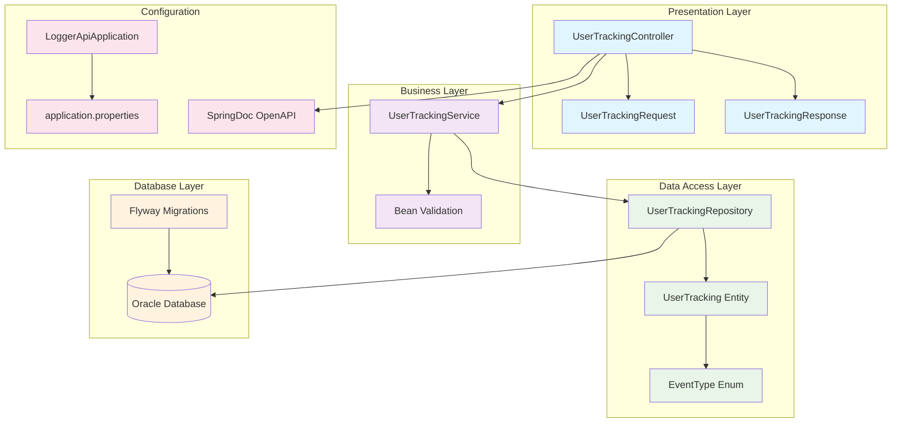
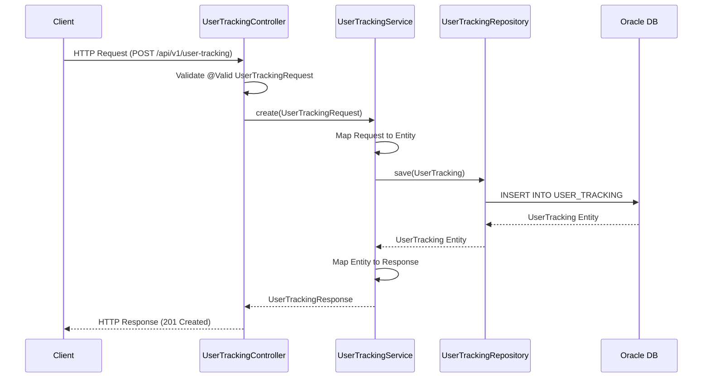

# Diagrama de Arquitetura - Logger API

## Arquitetura MVC com Camadas

## Fluxo de Dados

## Componentes Principais

### 1. Presentation Layer
- **UserTrackingController**: Controlador REST com 8 endpoints
- **UserTrackingRequest**: DTO de entrada com validações Bean Validation
- **UserTrackingResponse**: DTO de saída com dados completos

### 2. Business Layer
- **UserTrackingService**: Lógica de negócio e mapeamento entre DTOs e entidades
- **Bean Validation**: Validações automáticas com anotações Jakarta

### 3. Data Access Layer
- **UserTrackingRepository**: Interface JPA com métodos customizados
- **UserTracking**: Entidade JPA com mapeamento para Oracle
- **EventType**: Enum com 15 tipos de eventos predefinidos

### 4. Database Layer
- **Oracle Database**: Banco de dados empresarial (FIAP)
- **Flyway**: Versionamento e migrações automáticas

### 5. Configuration
- **LoggerApiApplication**: Classe principal Spring Boot
- **application.properties**: Configurações de banco e aplicação
- **SpringDoc OpenAPI**: Documentação automática da API

## Características Arquiteturais

- **Padrão MVC**: Separação clara entre Controller, Service e Repository
- **Injeção de Dependência**: Uso de @RequiredArgsConstructor (Lombok)
- **Transações**: @Transactional para operações de escrita
- **Paginação**: Suporte nativo com Spring Data Pageable
- **Validação**: Bean Validation no nível de entrada
- **Mapeamento**: Conversão manual entre camadas
- **Tratamento de Erros**: @ExceptionHandler básico no controller