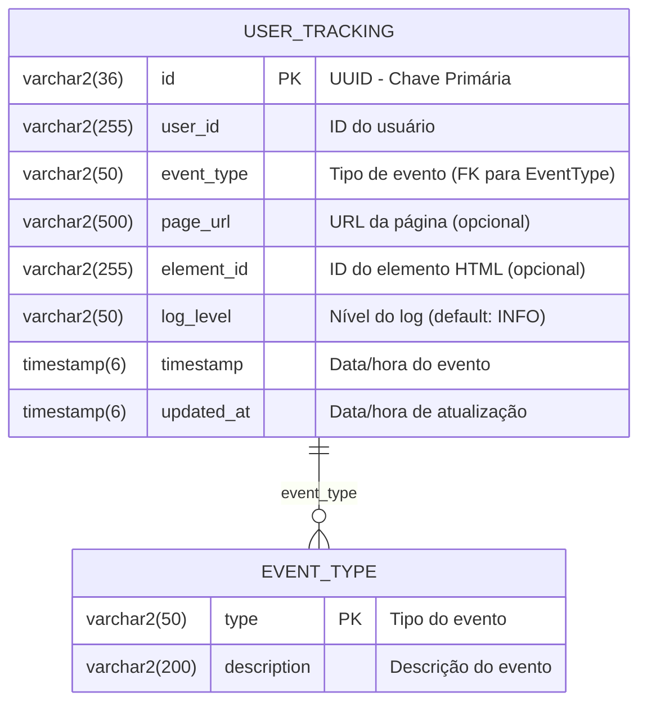

# Diagrama de Entidades - Logger API

## Diagrama ER (Entidade-Relacionamento)

## Modelo UML de Classes

```mermaid
classDiagram
    class UserTracking {
        -String id
        -String userId
        -EventType eventType
        -String pageUrl
        -String elementId
        -String logLevel
        -LocalDateTime timestamp
        -LocalDateTime updatedAt
        +prePersist() void
        +getId() String
        +setId(String) void
        +getUserId() String
        +setUserId(String) void
        +getEventType() EventType
        +setEventType(EventType) void
        +getPageUrl() String
        +setPageUrl(String) void
        +getElementId() String
        +setElementId(String) void
        +getLogLevel() String
        +setLogLevel(String) void
        +getTimestamp() LocalDateTime
        +setTimestamp(LocalDateTime) void
        +getUpdatedAt() LocalDateTime
        +setUpdatedAt(LocalDateTime) void
    }

    class EventType {
        <<enumeration>>
        BUTTON_CLICK
        FORM_SUBMIT
        PAGE_VIEW
        SCROLL
        HOVER
        LOGIN
        LOGOUT
        SEARCH
        FILE_DOWNLOAD
        FILE_UPLOAD
        ERROR
        NAVIGATION
        ITEM_SELECTED
        MODAL_OPEN
        MODAL_CLOSE
    }

    class UserTrackingRequest {
        -String userId
        -EventType eventType
        -String pageUrl
        -String elementId
        -String logLevel
        +getUserId() String
        +setUserId(String) void
        +getEventType() EventType
        +setEventType(EventType) void
        +getPageUrl() String
        +setPageUrl(String) void
        +getElementId() String
        +setElementId(String) void
        +getLogLevel() String
        +setLogLevel(String) void
    }

    class UserTrackingResponse {
        -String id
        -String userId
        -EventType eventType
        -String pageUrl
        -String elementId
        -String logLevel
        -LocalDateTime timestamp
        -LocalDateTime updatedAt
        +getId() String
        +setId(String) void
        +getUserId() String
        +setUserId(String) void
        +getEventType() EventType
        +setEventType(EventType) void
        +getPageUrl() String
        +setPageUrl(String) void
        +getElementId() String
        +setElementId(String) void
        +getLogLevel() String
        +setLogLevel(String) void
        +getTimestamp() LocalDateTime
        +setTimestamp(LocalDateTime) void
        +getUpdatedAt() LocalDateTime
        +setUpdatedAt(LocalDateTime) void
    }

    UserTracking --> EventType : uses
    UserTrackingRequest --> EventType : uses
    UserTrackingResponse --> EventType : uses
    UserTrackingRequest ..> UserTracking : maps to
    UserTracking ..> UserTrackingResponse : maps to
```

## Especificações das Entidades

### Tabela USER_TRACKING

| Campo | Tipo | Constraints | Descrição |
|-------|------|-------------|-----------|
| **id** | VARCHAR2(36) | PK, NOT NULL | UUID gerado automaticamente |
| **user_id** | VARCHAR2(255) | NOT NULL | Identificador do usuário |
| **event_type** | VARCHAR2(50) | NOT NULL, CHECK | Tipo de evento (enum) |
| **page_url** | VARCHAR2(500) | NULL | URL da página onde ocorreu o evento |
| **element_id** | VARCHAR2(255) | NULL | ID do elemento HTML interagido |
| **log_level** | VARCHAR2(50) | DEFAULT 'INFO' | Nível de log do evento |
| **timestamp** | TIMESTAMP(6) | NOT NULL, DEFAULT CURRENT_TIMESTAMP | Data/hora do evento |
| **updated_at** | TIMESTAMP(6) | NULL | Data/hora da última atualização |

### Enum EventType

Tipos de eventos suportados:

1. **BUTTON_CLICK** - Clique em botão
2. **FORM_SUBMIT** - Submissão de formulário
3. **PAGE_VIEW** - Visualização de página
4. **SCROLL** - Rolagem da página
5. **HOVER** - Hover sobre elemento
6. **LOGIN** - Login do usuário
7. **LOGOUT** - Logout do usuário
8. **SEARCH** - Busca realizada
9. **FILE_DOWNLOAD** - Download de arquivo
10. **FILE_UPLOAD** - Upload de arquivo
11. **ERROR** - Erro ocorrido
12. **NAVIGATION** - Navegação entre páginas
13. **ITEM_SELECTED** - Item selecionado
14. **MODAL_OPEN** - Abertura de modal
15. **MODAL_CLOSE** - Fechamento de modal

## Constraints e Índices

### Constraints
- **pk_user_tracking**: Chave primária no campo `id`
- **chk_event_type**: Check constraint validando valores do enum EventType

### Índices de Performance
- **idx_user_tracking_user_id**: Índice no campo `user_id` (consultas por usuário)
- **idx_user_tracking_timestamp**: Índice no campo `timestamp` (consultas temporais)
- **idx_user_tracking_event_type**: Índice no campo `event_type` (consultas por tipo)

## Relacionamentos

### UserTracking ↔ EventType
- **Tipo**: Composição/Enum
- **Cardinalidade**: N:1 (muitos UserTracking para um EventType)
- **Descrição**: Cada registro de UserTracking possui exatamente um EventType

## Validações JPA/Bean Validation

### UserTracking Entity
- `@NotBlank` em `userId`
- `@NotNull` em `eventType` e `timestamp`
- `@Size` em campos de texto para limites de tamanho
- `@PrePersist` para geração automática de UUID e timestamp

### UserTrackingRequest DTO
- `@NotBlank` em `userId`
- `@NotNull` em `eventType`
- `@Size` em todos os campos de texto para validação de tamanho